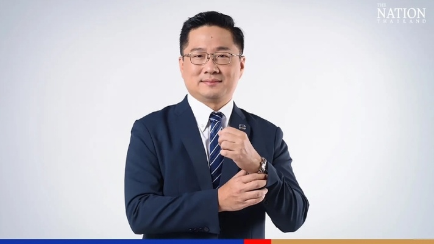

**Micro Leasing Pcl has embraced Nutanix’s cloud computing program to integrate customer needs with its diverse products, the company's deputy managing director of business resources and investment, Preeda Iramaneerat, said in a recent interview with The Nation.**

Micro Leasing, a truck financing company that has been around since 1997, has tided over a number of crises, such as the Asian financial crisis, the Hamburger crisis, and Covid-19. In 2018, the company entered into discussions with Nutanix to improve its existing infrastructure and hardware.

The move freed the company from having to rely on its IT staff for maintenance, Preeda said. When the Covid-19 pandemic hit, the company invested in Virtual Desktop Infrastructure, which allowed its employees to work remotely. They invested in laptops for employees who didn't have desktops and with proper infrastructure in place, Micro Leasing was able to navigate the pandemic, Preeda said.

With an increase in users, Micro Leasing expanded from 12 to 25 branches all over Thailand. The company's main focus was to provide better and faster customer service and financial advice to clients. The company has good relations with its customers and dealers because some of the trucks are sold through dealers. The company wants to maintain its customer service through digital channels, and a faster response time is key to that, Preeda said.

Micro Leasing's future is bright, with plans to expand its business into other domains. The company has set up a company called Micro Insure Broker, which offers insurance on trucks as well as broker services. Another business that they have started is called Micro Plus Leasing, which focuses on motorcycle leasing. The company aims to list Micro Plus Leasing on the stock market. Another company they are setting up is Micro Fin or Micro Finance, which will provide personal loans and vehicle title loans to customers.

> The company's roadmap from the beginning was to improve the infrastructure, both hardware and software. The next phase is to improve security and digital transformation. With these changes, the company hopes to expand its business and reach more customers

In light of recent cybersecurity threats and more people working remotely, Micro Leasing has invested in a new data protection system and plans to integrate and consolidate its customer data into a single platform.

Micro Leasing has since expanded to four companies offering different products. In order to better understand customer behavior and provide improved services, the company plans to combine all customer data into a single platform.

> "Our next phase this year is what we call Customer Data Platform. This will give us insights into customer behaviour and allow us to better serve our customers. We can upsell or cross-sell to our customers because some of them might already be our customers in the truck business but we can offer them other products like insurance or motorcycle leasing or personal loans as well."

To ensure that the integration of customer data is seamless and secure, the company is also utilising Application Programming Interface (API) technology. This will allow for easier communication and exchange of information between different systems, while also maintaining the security of customer data.

> "We are very concerned about cybersecurity and investment in terms of data leak protection to make sure that our system is secure to build trust with customers. Without proper infrastructure, it's very difficult to integrate everything together. With the APIs that we developed, it's much easier and more secure. This investment in data protection and consolidation of customer data highlights Micro Leasing’s commitment to providing top-notch services to its customers while also prioritising their security and privacy"
> - Preeda Iramaneerat

_Source:_ 🌐 [The nation](https://www.nationthailand.com/business/tech/40025112)
