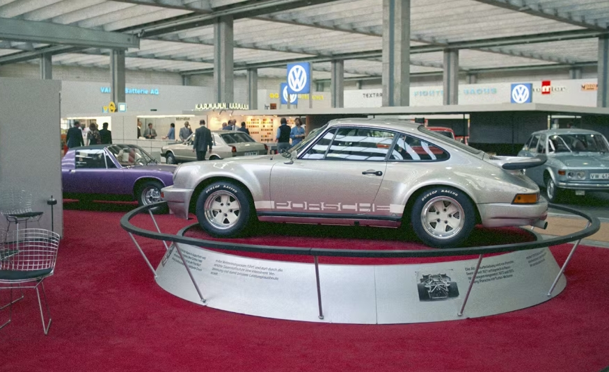
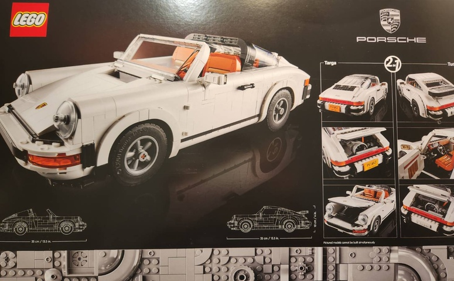
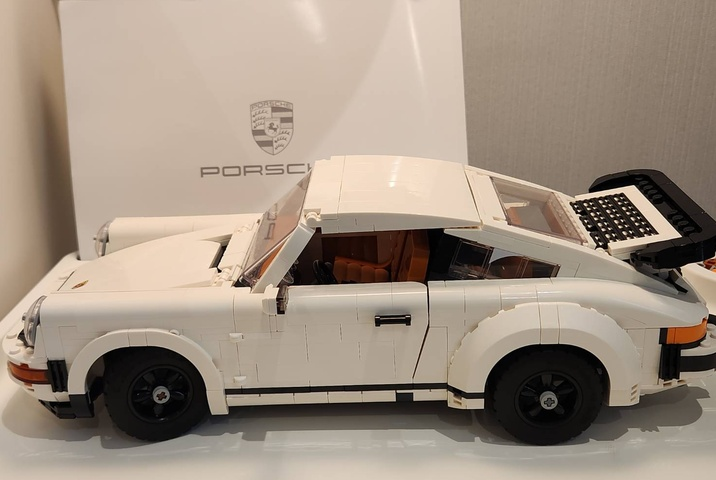
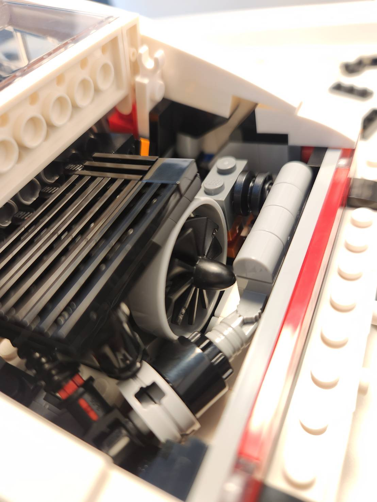
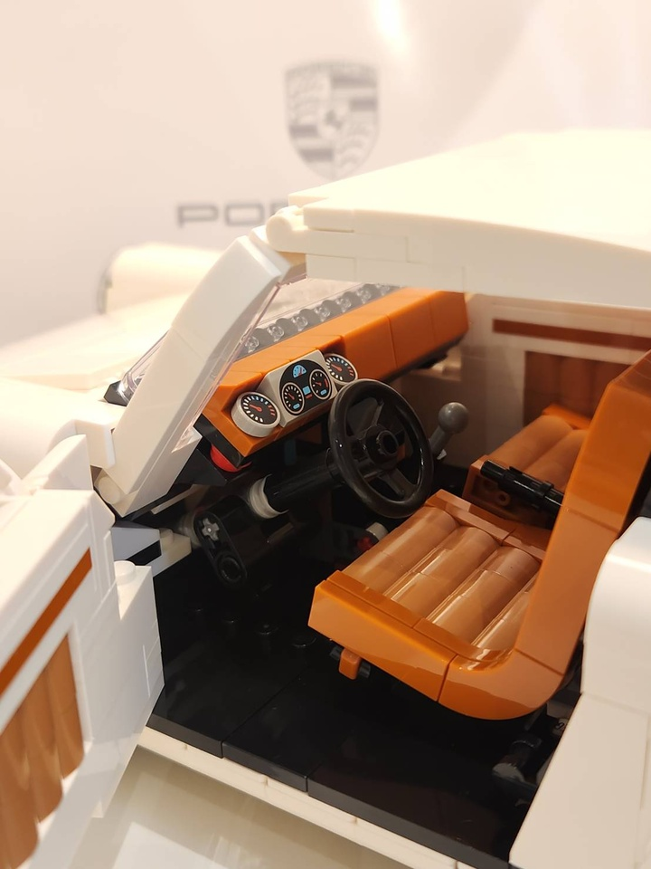
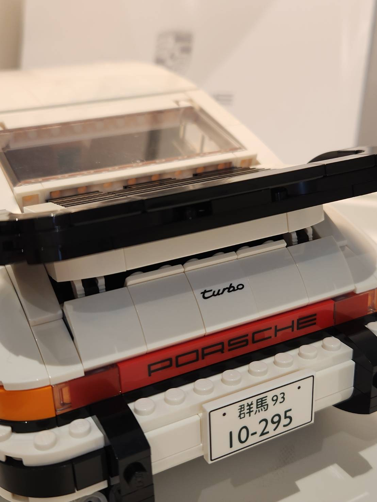
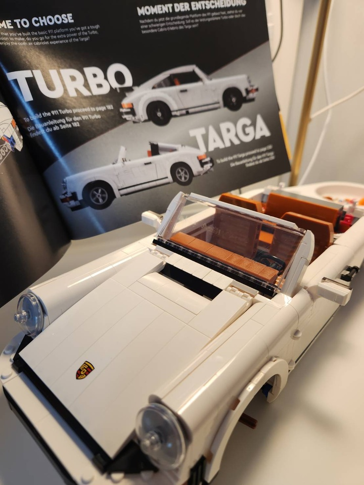

##### 🏎️ 50 years of porsche 911 Turbo!
The actual car was manufactured in 1974, but first appearing as a prototype at the 1973 Frankfurt Motor Show, the year I was born!

_Photo: Porsche Corporate Archive_

---
##### 🔍 Amazing details !
The details of this Lego design are amazing. Can't wait to unbox it!

---
##### 🕒 Time well spent !
Took me nearly 8 hour total to complete, but it was well worth it!

---
##### 🔥 Turbo engine!
The 3.0-litre Turbo engine fitted in the 911 (type 930) boasted a huge increase in power!

---
##### 🪑 The Interior.
The color choice for this Lego Porsche interior is stunning! From the leather seats, detailed dashboard, steering wheel, and handbrake!

---
##### 🛬 The Iconic rear wing!
One of the most iconic design of porsche Turbo. Time to fly!

---
##### 🚘 Targa is next.
I'll wait a couple of months before rebuilding it into a Targa 😄.

Until next time!

---
_Source:_
- [Dr. Ing. h.c. F. Porsche AG](https://www.porsche.com/stories/innovation/50-years-of-the-porsche-turbo-explained/)
- [Celebrating 50 years of Turbo with LEGO® and Porsche](https://www.porsche.com/stories/culture/celebrating-50-years-of-turbo-with-lego-and-porsche/)

---
#### 🔗 Connect

_I’m building Prevalis Strategies as a technical + strategic consulting venture. Follow the journey, learn with me, or drop suggestions or questions!_

> **Domain:** [https://prevalis.ai](https://prevalis.ai)  
> **Email:** [info@prevalis.ai]  
> **Built & maintained by:** [prevalis.ai](https://prevalis.ai) ✨
